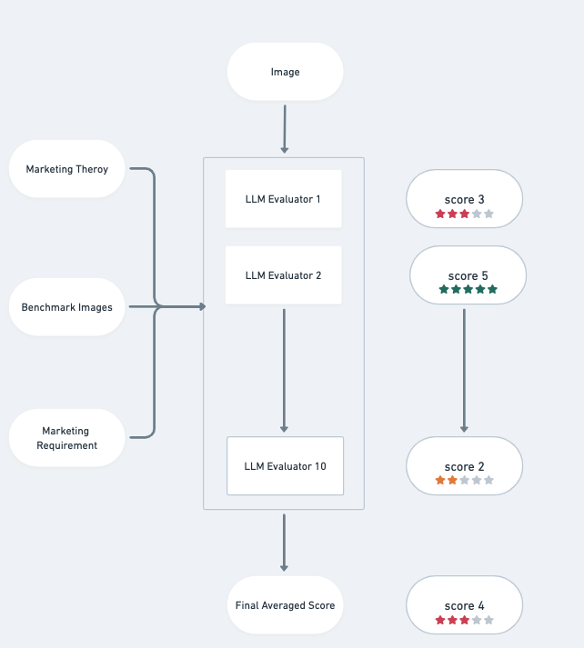

# AIGC

## 📚 Installation & Usage Guide 

# Image Examples and Comparison

## 1. Variation Comparison
### Human Design
<<<<<<< HEAD

=======

>>>>>>> 644d35111aa5083c36ff48ef2149adda92a98afb

---
 ### AIGC Baseline

---
### AIGC with Our System
<<<<<<< HEAD

=======

>>>>>>> 644d35111aa5083c36ff48ef2149adda92a98afb

---
## 2. Hotel Surroundings vs Hotel Amendities Example Comparison

### Original Image Hotel Surroundings (Left) vs Hotel Amendities (Right)
<<<<<<< HEAD

=======

>>>>>>> 644d35111aa5083c36ff48ef2149adda92a98afb

---

### AIGC With System Hotel Surrondings

### AIGC With System Hotel Amendities

---
## 3. Close-up vs Long-shot Example Comparison

### Original Close Up (Left) vs Long Shot (Right) for Saving Pot

### Original Close Up (Left) vs Long Shot (Right) for Credit Card

---

### AIGC With System Close Up (Above) vs Long Shot (Below) for Saving Pot

### AIGC With System Close Up (Above) vs Long Shot (Below) for Credit Card

### AIGC With System Close Up (Above) vs Long Shot (Below) for Wireless Earbuds

### AIGC With System Close Up (Above) vs Long Shot (Below) for Perfume

### AIGC With System Close Up (Above) vs Long Shot (Below) for Dry Fruit

### AIGC With System Close Up (Above) vs Long Shot (Below) for Facial Tissue

### AIGC With System Close Up (Above) vs Long Shot (Below) for Dun Dun Plush Toy

---

## 4. Realistic vs Unrealistic Comparison

### Original Realistic (Above) vs Unrealistic (Below) 1
<<<<<<< HEAD

### Original Realistic (Above) vs Unrealistic (Below) 2

=======

### Original Realistic (Above) vs Unrealistic (Below) 2

>>>>>>> 644d35111aa5083c36ff48ef2149adda92a98afb

---
### AIGC with System Realistic (Above) vs Unrealistic (Below) for Avocado

### AIGC with System Realistic (Above) vs Unrealistic (Below) for Bread

### AIGC with System Realistic (Above) vs Unrealistic (Below) for Cupcake

### AIGC with System Realistic (Above) vs Unrealistic (Below) for Popcorn

### AIGC with System Realistic (Above) vs Unrealistic (Below) for Car

## 5.Evaluating Workflow

