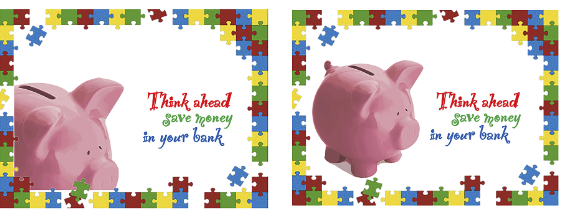
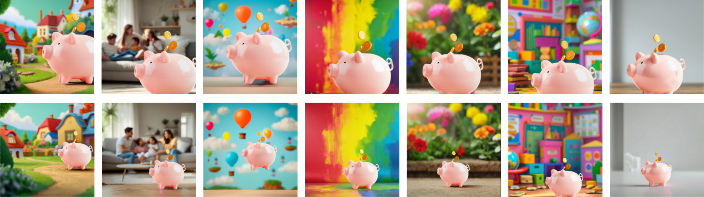
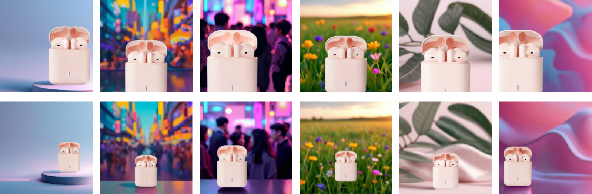
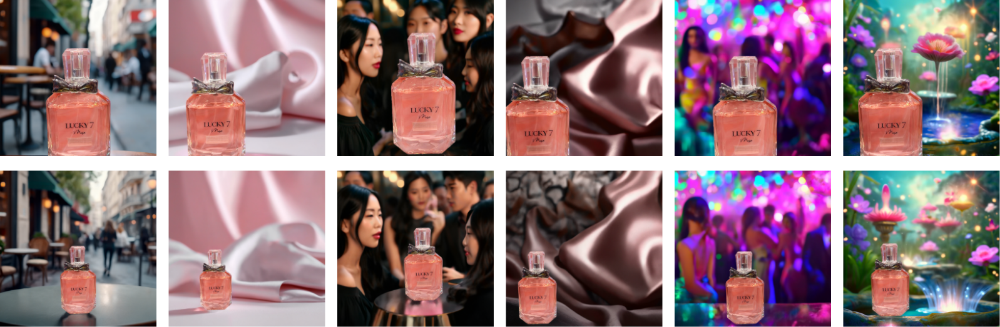
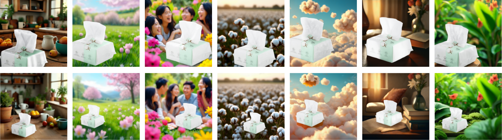
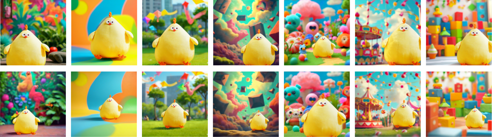
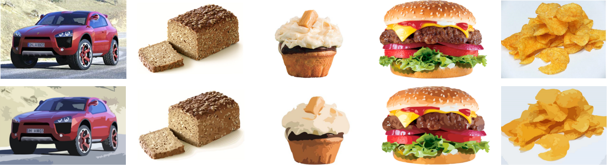
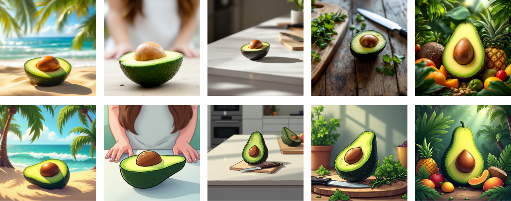
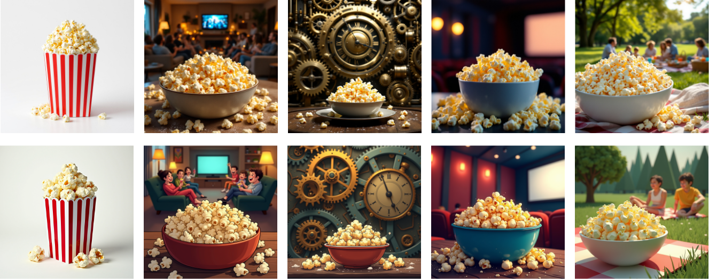
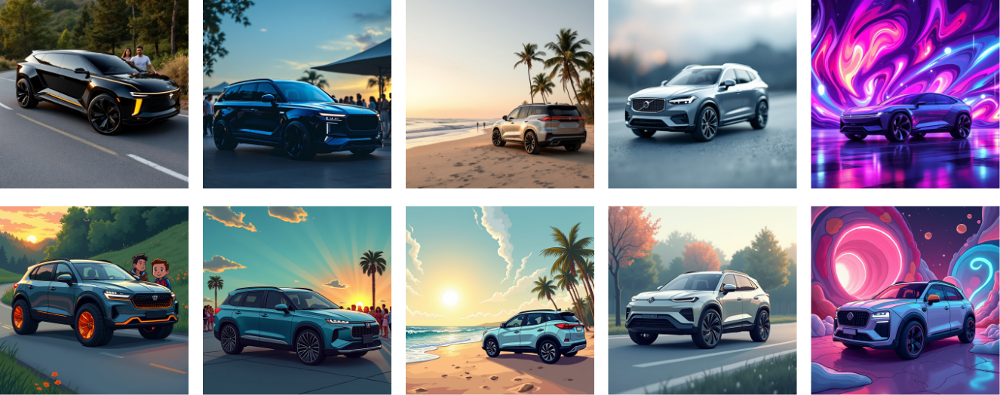

# Study 3 (Theory Validation Applications) Images

Our system generates multiple sets of product images with controlled levels of focal variable, addressing  limited and narrowly defined image set in the original studies. By varying only focal feature while keeping other features constant, more systematic testing of how these feature affect consumer perception can be achieved. 
## 1. Hotel Surroundings vs Hotel Amendities Example Comparison

### Original Image Hotel Surroundings (Left) vs Hotel Amendities (Right)

---

### AIGC With System Hotel Surrondings

### AIGC With System Hotel Amendities

---
## 2. Close-up vs Long-shot Example Comparison

### Original Close Up (Left) vs Long Shot (Right) for Saving Pot

### Original Close Up (Left) vs Long Shot (Right) for Credit Card

---

### AIGC With System Close Up (Above) vs Long Shot (Below) for Saving Pot

### AIGC With System Close Up (Above) vs Long Shot (Below) for Credit Card

### AIGC With System Close Up (Above) vs Long Shot (Below) for Wireless Earbuds

### AIGC With System Close Up (Above) vs Long Shot (Below) for Perfume

### AIGC With System Close Up (Above) vs Long Shot (Below) for Dry Fruit

### AIGC With System Close Up (Above) vs Long Shot (Below) for Facial Tissue

### AIGC With System Close Up (Above) vs Long Shot (Below) for Dun Dun Plush Toy

---

## 3. Realistic vs Unrealistic Comparison

### Original Realistic (Above) vs Unrealistic (Below) 1

### Original Realistic (Above) vs Unrealistic (Below) 2

---
### AIGC with System Realistic (Above) vs Unrealistic (Below) for Avocado

### AIGC with System Realistic (Above) vs Unrealistic (Below) for Bread

### AIGC with System Realistic (Above) vs Unrealistic (Below) for Cupcake

### AIGC with System Realistic (Above) vs Unrealistic (Below) for Popcorn

### AIGC with System Realistic (Above) vs Unrealistic (Below) for Car
